# Student Task Manager

A simple web-based **Student Task Manager** developed as a pair-based collaborative project using Git and GitHub.

The application allows users to add tasks, display tasks,  delete tasks, and search for tasks.

---

## Team Members

| Student | Name | Roll No | GitHub Username |
|---|---|---|---|
| Student 1 | Dua Iman | BSDSF25A035 | Dua-Iman |
| Student 2 | Noor Fatima Zafar | BSDSF25A017 | N-Zafar |

---

## GitHub Repository: `<https://github.com/Dua-Iman/student-task-manager>`

---

## Features

The Student Task Manager provides the following features:

- Add new tasks
- Enter task title
- Enter task description
- Display tasks
- Search tasks
- User-friendly interface
- Responsive layout

---

## Technologies

The project was developed using the following technologies:

- **HTML** — Used to create the structure of the Student Task Manager.
- **CSS** — Used for styling, layout, buttons, task cards, and responsive design.
- **JavaScript** — Used to implement task management functionality and user interaction.
- **Git** — Used for version control, commits, branches, merging, conflict resolution, and recovery operations.
- **GitHub** — Used for remote repository hosting and collaborative development.

---
## Git Workflow

- [x] Create Project
- [x] Initialize Git
- [x] Create Commits
- [x] Create GitHub Repository
- [x] Create Branches
- [x] Develop Features
- [x] Push Branches
- [x] Create Issues
- [x] Create Pull Requests
- [x] Code Review
- [x] Merge
- [x] Create and Resolve Merge Conflict
- [x] Use Git Recovery Commands
- [x] Create Tag and Release

## Branches

- [x] `main`
  - Main and stable branch of the project.

- [x] `feature/task-form`
  - Used to develop the task input form.
  - Added task title, description, and Add button.

- [x] `feature/task-style`
  - Used to improve the application styling.
  - Included layout, buttons, task cards, and responsive design.

- [x] `feature/task-search`
  - Used to implement the task search functionality through issue-based development.

  ## How to Run

### Requirements

- Visual Studio Code
- Git installed on the system
- Windows Command Prompt (CMD)
- A web browser

### Open the Project

1. Open the project folder in Visual Studio Code.
2. Open Command Prompt (CMD).
3. Navigate to the project folder using the `cd` command if required.

## Screenshots

These are screenshots containing implementation of a few Git commands. The complete details of the screenshots are available in the submitted Word Document.

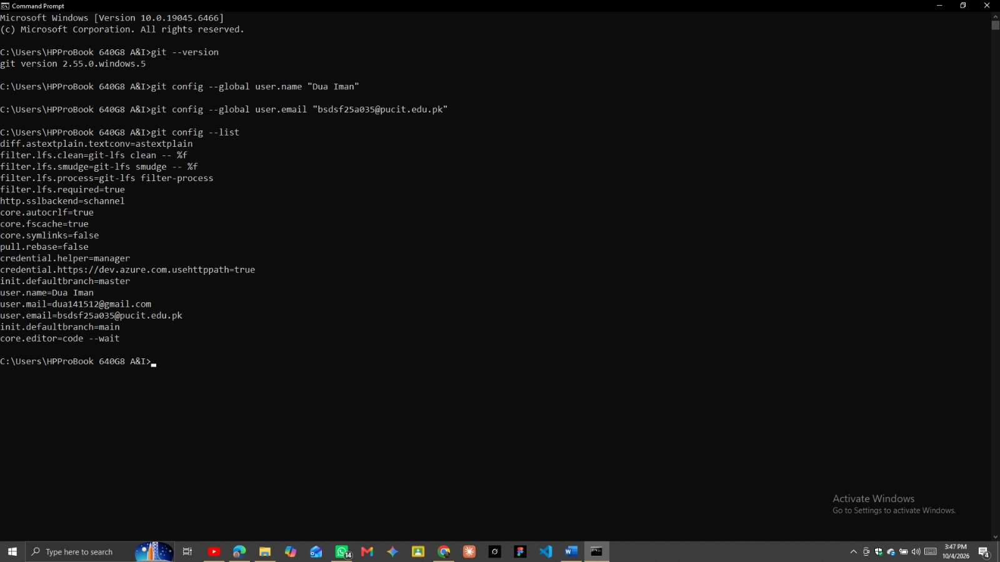
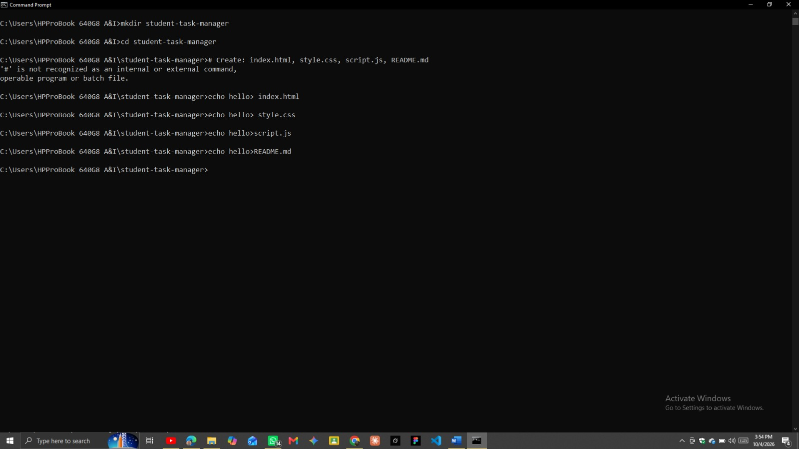
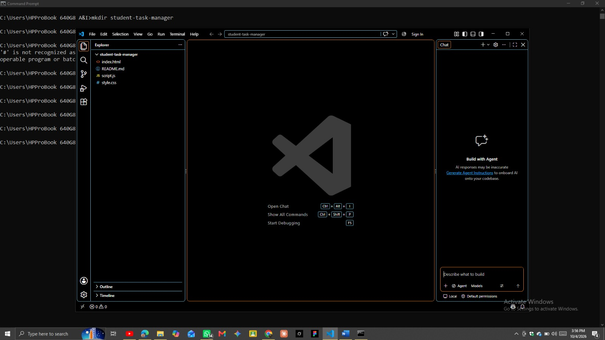
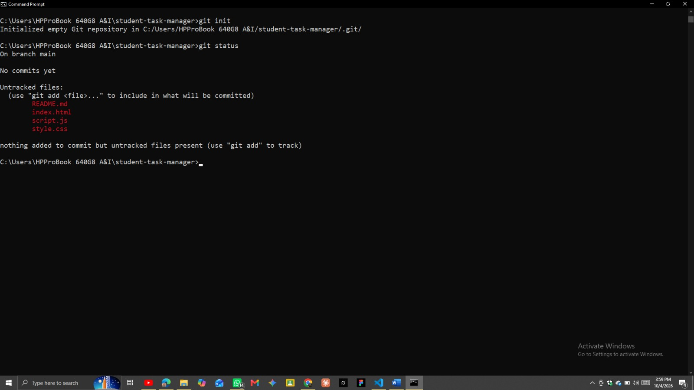
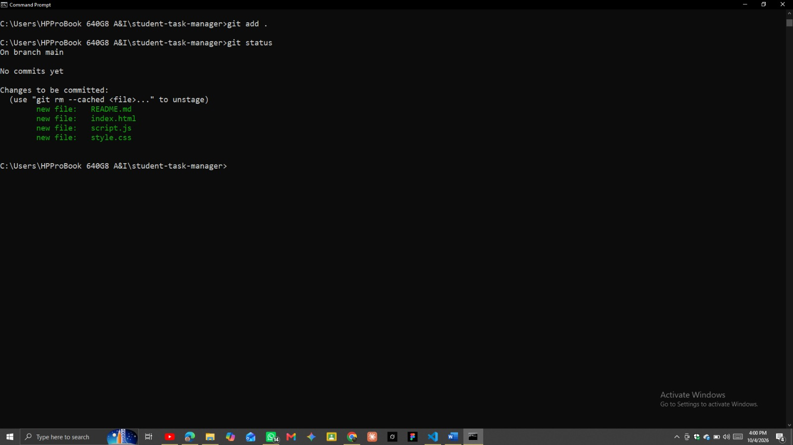
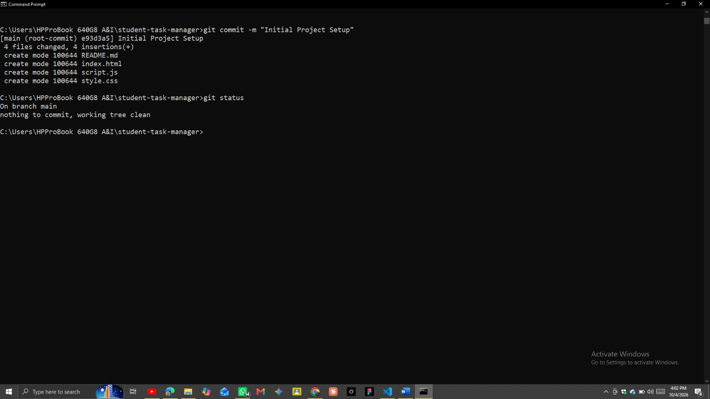
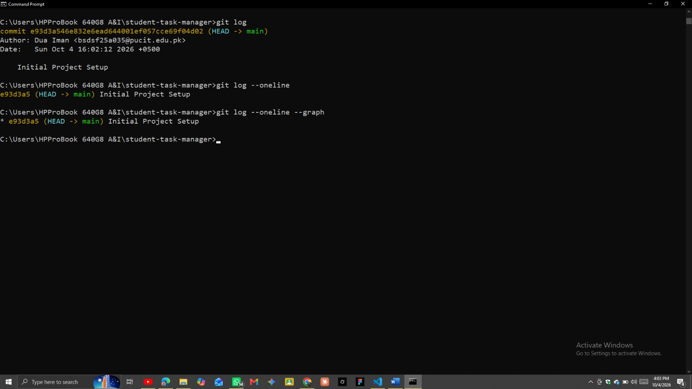
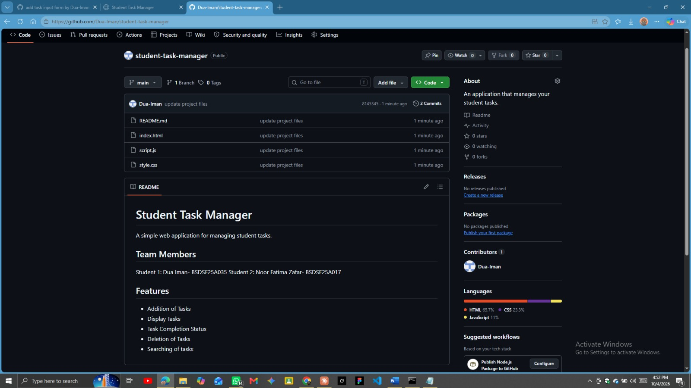
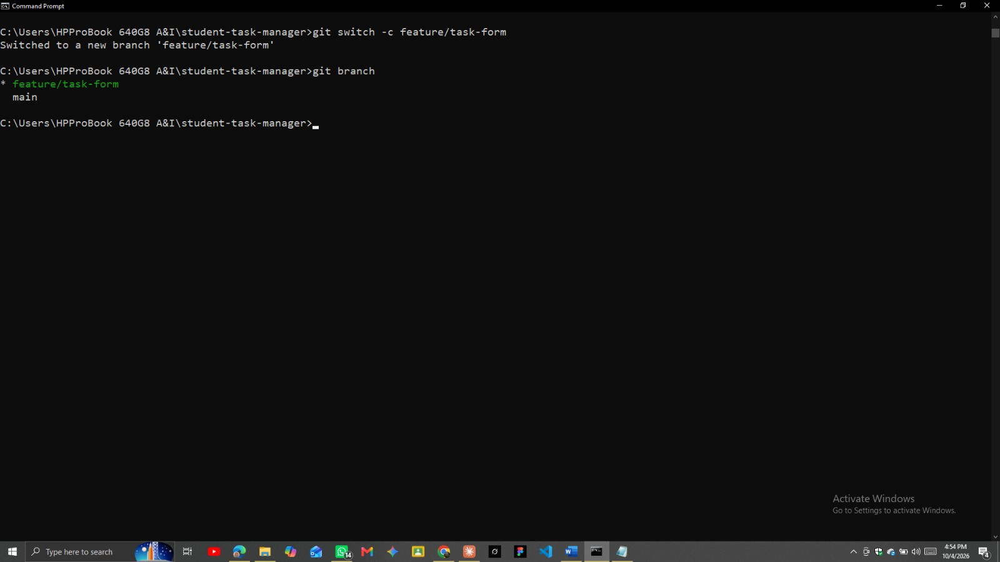
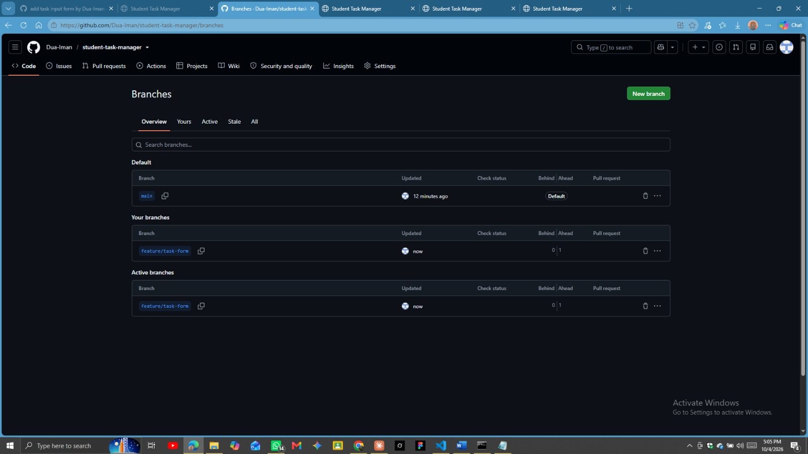
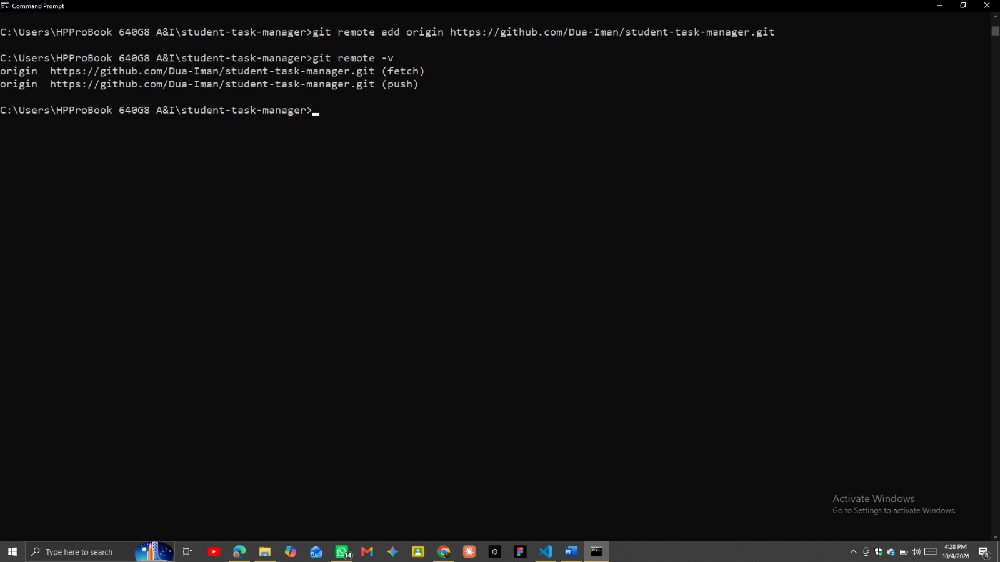
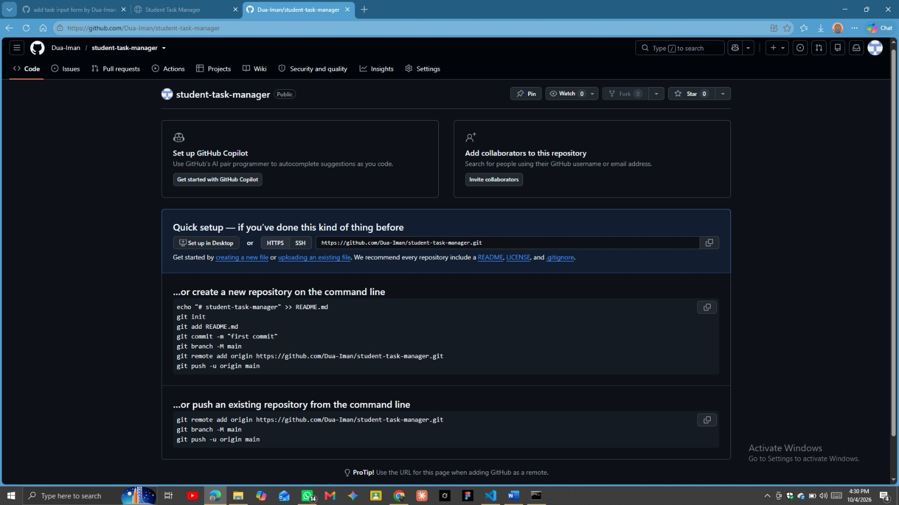
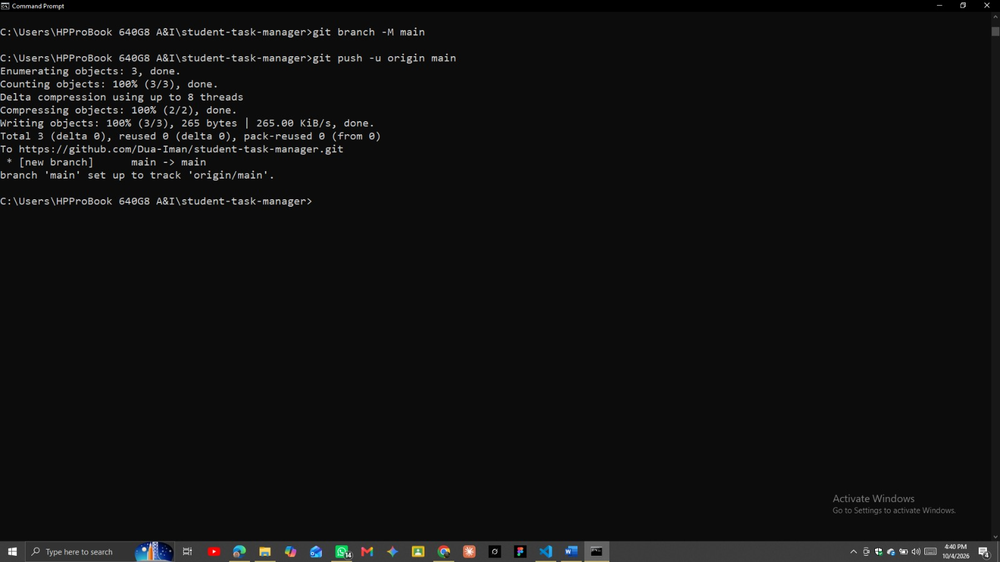

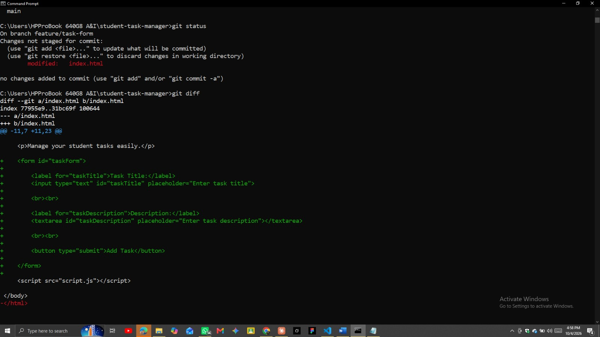
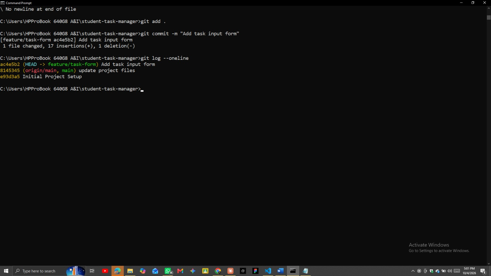
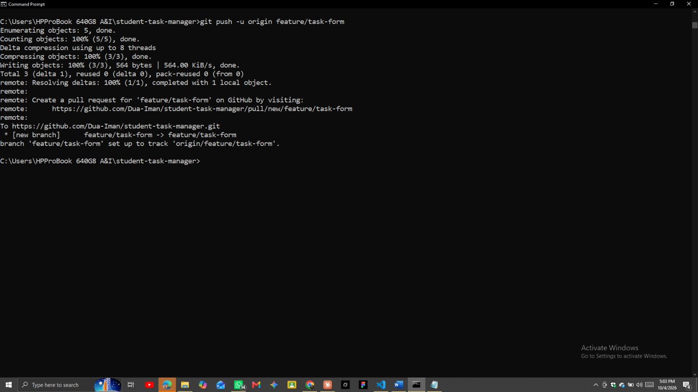
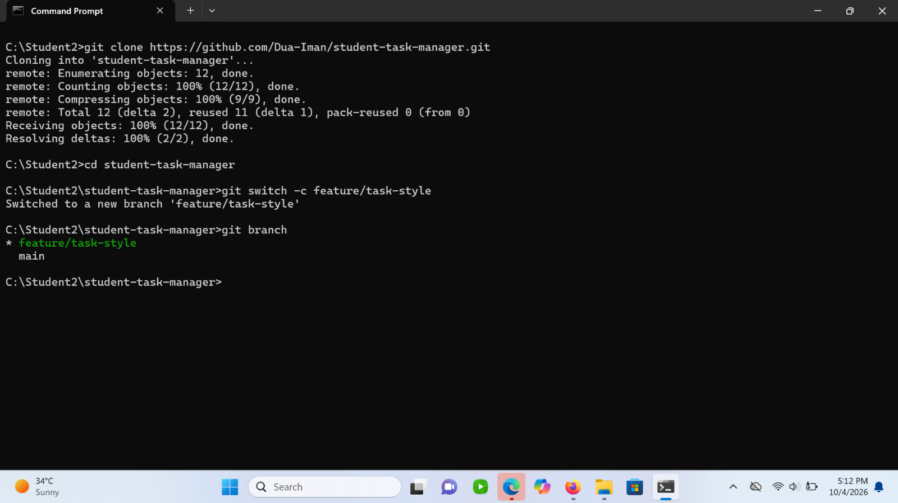
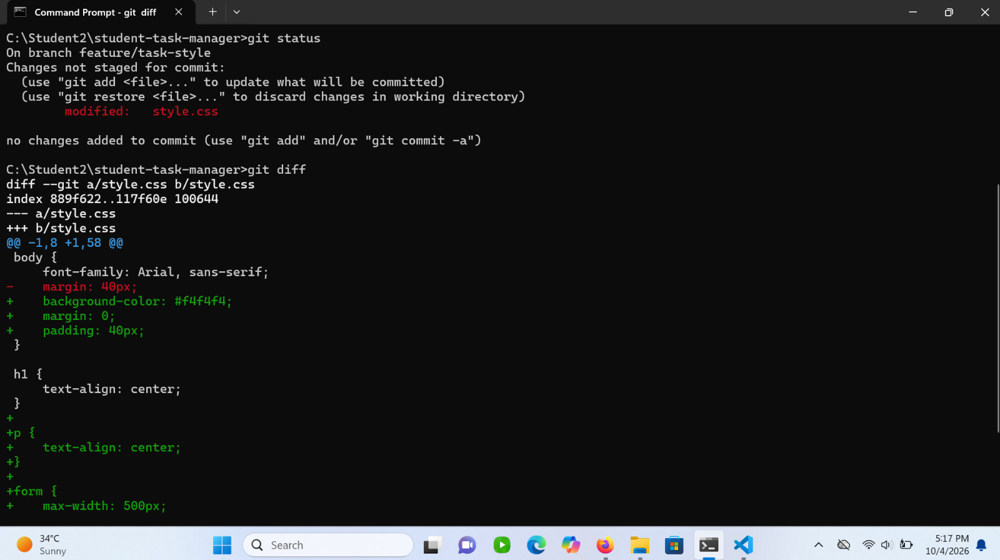

---

## Version History

---

## Contributions

